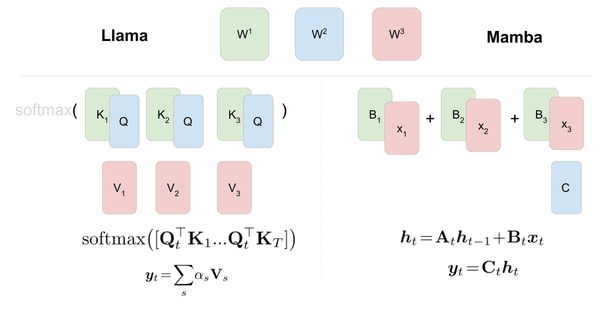
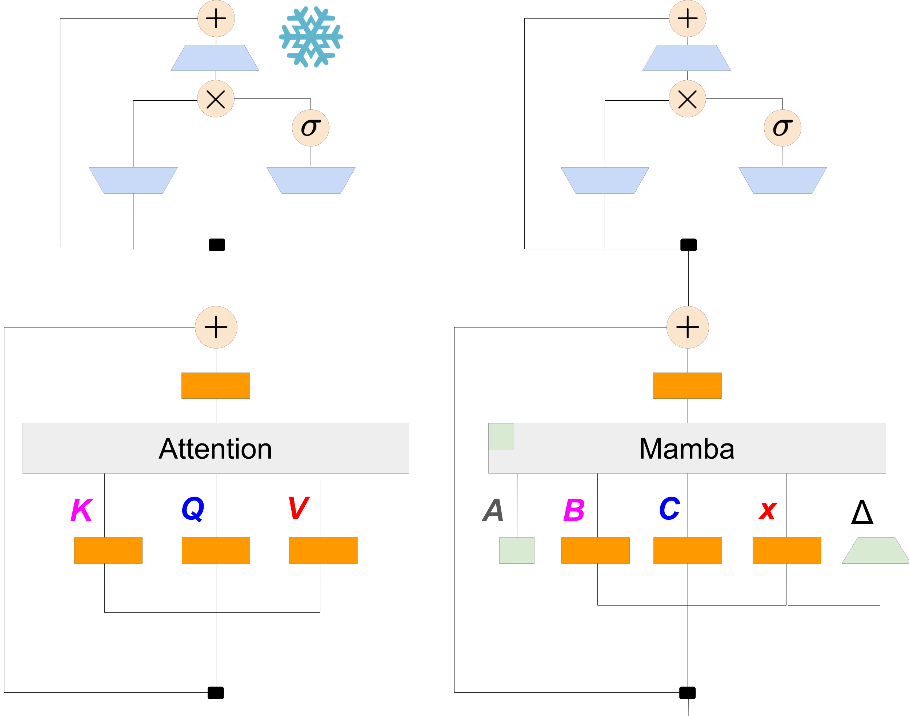

# MambaInLlama

This repository contains the code and released models for our paper.

<div style="display: flex; justify-content: space-between;">
    
    
</div>

Our goal is to distill a large Transformer into a (Hybrid)-Mamba model while preserving the generational quality with the best effort. Typically, you only need 8x80G A100 (with very **limited** resources) and run for 3 to 4 days to reproduce our results. Our approach can be used for both base models and chat models.

## Changelog 
- **[2024.08.26]** [Hybrid Mamba models](https://huggingface.co/JunxiongWang?search_models=MambaInLlama) and [Hybrid Mamba2 models](https://huggingface.co/JunxiongWang?search_models=Mamba2InLlama) distilled from [meta-llama/Meta-Llama-3-8B-Instruct](https://huggingface.co/meta-llama/Meta-Llama-3-8B-Instruct) are available.
- **[2024.07.18]** We release first version code and models. We are distilling [meta-llama/Meta-Llama-3-8B-Instruct](https://huggingface.co/meta-llama/Meta-Llama-3-8B-Instruct). Stay tuned for updates.

## Released Models

### Hybrid Mamba distilled from Llama3

| Teacher Model | Hybrid Mamba Model - DPO |Hybrid Mamba2 Model - DPO |
|---------------|---------------------------|---------------------------|
| Meta-Llama-3-8B-Instruct     | [Mamba (1/2 attention)](https://huggingface.co/JunxiongWang/MambaInLlama_0_50)  | [Mamba2 (1/2 attention)](https://huggingface.co/JunxiongWang/Mamba2InLlama_0_50)  |
|               | [Mamba (1/4 attention)](https://huggingface.co/JunxiongWang/MambaInLlama_0_75)  | [Mamba2 (1/4 attention)](https://huggingface.co/JunxiongWang/Mamba2InLlama_0_75)  |
|               | [Mamba (1/8 attention)](https://huggingface.co/JunxiongWang/MambaInLlama_0_875) | [Mamba2 (1/8 attention)](https://huggingface.co/JunxiongWang/Mamba2InLlama_0_875)  |
|               | | [Mamba2 (0 attention)](https://huggingface.co/JunxiongWang/Mamba2InLlama_1) |


| Model | MMLU <br> (5 shots) | AlpacaEval <br> (LC win against GPT-4) | MT-Bench <br> (scored by GPT-4) |
|-------|----------------|-----------------------------------|----------------------------|
| [Mamba (1/2 attention)](https://huggingface.co/JunxiongWang/MambaInLlama_0_50) | 59.26 | 29.61 | 7.35 |
| [Mamba2 (1/2 attention)](https://huggingface.co/JunxiongWang/Mamba2InLlama_0_50) | 56.67 | 25.00 | 7.32 |
| [Mamba (1/4 attention)](https://huggingface.co/JunxiongWang/MambaInLlama_0_75) | 52.68 | 25.85 | 6.86 |
| [Mamba2 (1/4 attention)](https://huggingface.co/JunxiongWang/Mamba2InLlama_0_75) | 53.94 | 20.25 | 6.74 |
| [Mamba (1/8 attention)](https://huggingface.co/JunxiongWang/MambaInLlama_0_875) | 49.20 | 20.76 | 6.46 |
| [Mamba2 (1/8 attention)](https://huggingface.co/JunxiongWang/Mamba2InLlama_0_875) | 50.85 | 20.25 | 6.48 |
| [Mamba2 (0 attention)](https://huggingface.co/JunxiongWang/Mamba2InLlama_1) | 43.19 | 14.49 | 5.64 |

For reproduction, please follow the instructions [here](mamba_llama/README.md).

### Hybrid Mamba distilled from Zephyr

| Teacher Model | Hybrid Mamba Model - SFT                          | Hybrid Mamba Model - DPO                         | Hybrid Mamba Model - DPO                         |
|---------------|---------------------------------------------------|--------------------------------------------------|--------------------------------------------------|
| Zephyr        | [Mamba (1/2 attention)](https://huggingface.co/JunxiongWang/mamba_0_5_sft)   | [Mamba (1/2 attention)](https://huggingface.co/JunxiongWang/mamba_0_5_dpo_ep1)   | [Mamba (1/2 attention)](https://huggingface.co/JunxiongWang/mamba_0_5_dpo_ep3)   |
|               | [Mamba (1/4 attention)](https://huggingface.co/JunxiongWang/mamba_0_75_sft)  | [Mamba (1/4 attention)](https://huggingface.co/JunxiongWang/mamba_0_75_dpo_ep1)  | [Mamba (1/4 attention)](https://huggingface.co/JunxiongWang/mamba_0_75_dpo_ep3)  |
|               | [Mamba (1/8 attention)](https://huggingface.co/JunxiongWang/mamba_0_875_sft) | [Mamba (1/8 attention)](https://huggingface.co/JunxiongWang/mamba_0_875_dpo_ep1) | [Mamba (1/8 attention)](https://huggingface.co/JunxiongWang/mamba_0_875_dpo_ep3) |


| Model | MMLU <br> (5 shots) | AlpacaEval <br> (LC win against GPT-4) | MT-Bench <br> (scored by GPT-4) |
|-------|---------------------|-----------------------------------|----------------------------|
| [Zephyr](https://huggingface.co/HuggingFaceH4/zephyr-7b-beta) | 61.44 | 13.20 | 7.34 |
| [Mamba DPO 1 (1/2 attention)](https://huggingface.co/JunxiongWang/mamba_0_5_dpo_ep1) | 55.23 | 20.66 | 7.12 |
| [Mamba DPO 3 (1/2 attention)](https://huggingface.co/JunxiongWang/mamba_0_5_dpo_ep3) | 55.38 | 17.48 | 7.31 |
| [Mamba DPO 1 (1/4 attention)](https://huggingface.co/JunxiongWang/mamba_0_75_dpo_ep1) | 50.94 | 17.16 | 7.03 |
| [Mamba DPO 3 (1/4 attention)](https://huggingface.co/JunxiongWang/mamba_0_75_dpo_ep3) | 51.19 | 13.89 | 6.58 |
| [Mamba DPO 1 (1/8 attention)](https://huggingface.co/JunxiongWang/mamba_0_875_dpo_ep1) | 48.35 | 15.32 | 6.39 |
| [Mamba DPO 3 (1/8 attention)](https://huggingface.co/JunxiongWang/mamba_0_875_dpo_ep3) | 48.44 | 12.67 | 6.37 |

For reproduction, please follow the instructions [here](mamba_zephyr/README.md).

## Usage

### Environment
We provide an [environment file](environment.yml) that lists the specific Python package versions used in our experiments. To ensure the best reproducibility, we suggest using these same package versions. Nonetheless, you may also use alternative versions and still be able to run the program. The alignment-handbook version that we use is [here](https://github.com/huggingface/alignment-handbook/tree/606d2e954fd17999af40e6fb4f712055ca11b2f0). The following script is to install `mamba-ssm==2.2.2` and cuda-11.8.0.

```
# CUDA>=11.6 needed for `mamba-ssm` and `causal-conv1d`.
conda install -c "nvidia/label/cuda-11.8.0" cuda-toolkit
# Install PyTorch (with CUDA 11.8) before everything else. those assume you are using cu118
pip install torch --index-url https://download.pytorch.org/whl/cu118

pip install causal-conv1d==1.4.0
pip install flash-attn==2.6.3
```

If you install mamba-ssm using `pip install mamba-ssm==2.2.2`, you will need to manually change `CONDA_ENV_PATH/site-packages/mamba_ssm/modules/mha.py` to [this version](https://github.com/state-spaces/mamba/blob/014c094d11f780a27330657faabecaaded7a31db/mamba_ssm/modules/mha.py) to support GQA, since GQA is used in Llama3. The **mamba-ssm** used in my experiment is from this [commit](https://github.com/state-spaces/mamba/tree/49ddf8321e4987650e8dc8dc44caa44b892f207a).


Alternatively, you can build mamba-ssm from source, but ensure the commit is after [this one](https://github.com/state-spaces/mamba/commit/014c094d11f780a27330657faabecaaded7a31db), which fixes the GQA bugs in generations.

### Generation Example

Mamba:

```
import torch
from transformers import AutoTokenizer
from mamba_inference.hybrid_wrapper import MambaTransformerHybridModelWrapper

pretrained_model_name = "JunxiongWang/MambaInLlama_0_50" # change the model that you want to test here
model = MambaTransformerHybridModelWrapper.from_pretrained(pretrained_model_name, torch_dtype=torch.bfloat16)
model.eval()

messages = [[
    {
        "role": "user",
        "content": "## Question: \n\nFarmer Brown has 20 animals on his farm, all either chickens or cows. They have a total of 70 legs, all together. How many of the animals are chickens? ## Instruction \n\nPlease answer this question by first reasoning and then providing your answer.",
    },
]]

tokenizer = AutoTokenizer.from_pretrained(pretrained_model_name)
formatted_prompts = [
    tokenizer.apply_chat_template(message, tokenize=False, add_generation_prompt=True) for message in messages
]

prompts = [
    tokenizer.encode(formatted_prompt, return_tensors="pt", truncation=True, max_length=200)
    for formatted_prompt in formatted_prompts
]
batch_prompts = torch.cat(prompts, dim=0).cuda()

outputs = model.generate(
    input_ids=batch_prompts,
    max_length=1000,
    cg=True,
    return_dict_in_generate=True,
    output_scores=True,
    enable_timing=True,
    top_k=1,
    eos_token_id=tokenizer.eos_token_id
)

generated_text = tokenizer.batch_decode(outputs.sequences.tolist())
print(generated_text[0])

#output:
#Let's denote the number of chickens as C and the number of cows as K. We know that:
#1. There are 20 animals in total: C + K = 20.
#2. Chickens have 2 legs and cows have 4 legs. Together, they have 70 legs: 2C + 4K = 70.
#Now, we can solve these equations step by step:
#From the first equation, we can express K in terms of C:
#K = 20 - C
#Substitute this expression into the second equation:
#2C + 4(20 - C) = 70
#Simplify and solve for C:
#2C + 80 - 4C = 70
#-2C = -10
#C = 5
#So, there are 5 chickens on Farmer Brown's farm.
```

Mamba 2:

```
import torch
from transformers import AutoTokenizer
from mamba2_inference.hybrid_wrapper import MambaTransformerHybridModelWrapper

pretrained_model_name = "JunxiongWang/Mamba2InLlama_0_50" # change the model that you want to test here
model = MambaTransformerHybridModelWrapper.from_pretrained(pretrained_model_name, torch_dtype=torch.bfloat16)
model.eval()

messages = [[
    {
        "role": "user",
        "content": "## Question: \n\nFarmer Brown has 20 animals on his farm, all either chickens or cows. They have a total of 70 legs, all together. How many of the animals are chickens? ## Instruction \n\nPlease answer this question by first reasoning and then providing your answer.",
    },
]]

tokenizer = AutoTokenizer.from_pretrained(pretrained_model_name)
formatted_prompts = [
    tokenizer.apply_chat_template(message, tokenize=False, add_generation_prompt=True) for message in messages
]

prompts = [
    tokenizer.encode(formatted_prompt, return_tensors="pt", truncation=True, max_length=200)
    for formatted_prompt in formatted_prompts
]
batch_prompts = torch.cat(prompts, dim=0).cuda()

outputs = model.generate(
    input_ids=batch_prompts,
    max_length=1000,
    cg=True,
    return_dict_in_generate=True,
    output_scores=True,
    enable_timing=True,
    top_k=1,
    eos_token_id=tokenizer.eos_token_id
)

generated_text = tokenizer.batch_decode(outputs.sequences.tolist())
print(generated_text[0])

#output:
#**Step 1:** Let's denote the number of chickens as C and the number of cows as K.
#**Step 2:** Chickens have 2 legs each, and cows have 4 legs each. We can create an equation based on the total number of legs:
#2C (chicken legs) + 4K (cow legs) = 70 legs
#**Step 3:** We also know that there are 20 animals in total:
#C + K = 20
#**Step 4:** Solve the second equation for one variable, let's say K:
#K = 20 - C
#**Step 5:** Substitute the expression for K in the first equation:
#2C + 4(20 - C) = 70
#**Step 6:** Simplify and solve for C:
#2C + 80 - 4C = 70
#-2C = -10
#C = 5
#**Conclusion:** There are 5 chickens on Farmer Brown's farm.
```

## Evaluation

Please follow the instructions [here](benchmark/README.md)

## Citation
If you use this codebase, or otherwise found our work valuable, please cite:

```
@article{junxiongdaniele2024mambainllama,
  title   = {The Mamba in the Llama: Distilling and Accelerating Hybrid Models},
  author  = {Junxiong Wang and Daniele Paliotta and Avner May and Alexander M. Rush and Tri Dao},
  journal = {arXiv preprint arXiv:2408.15237},
  year    = {2024}
}
```


